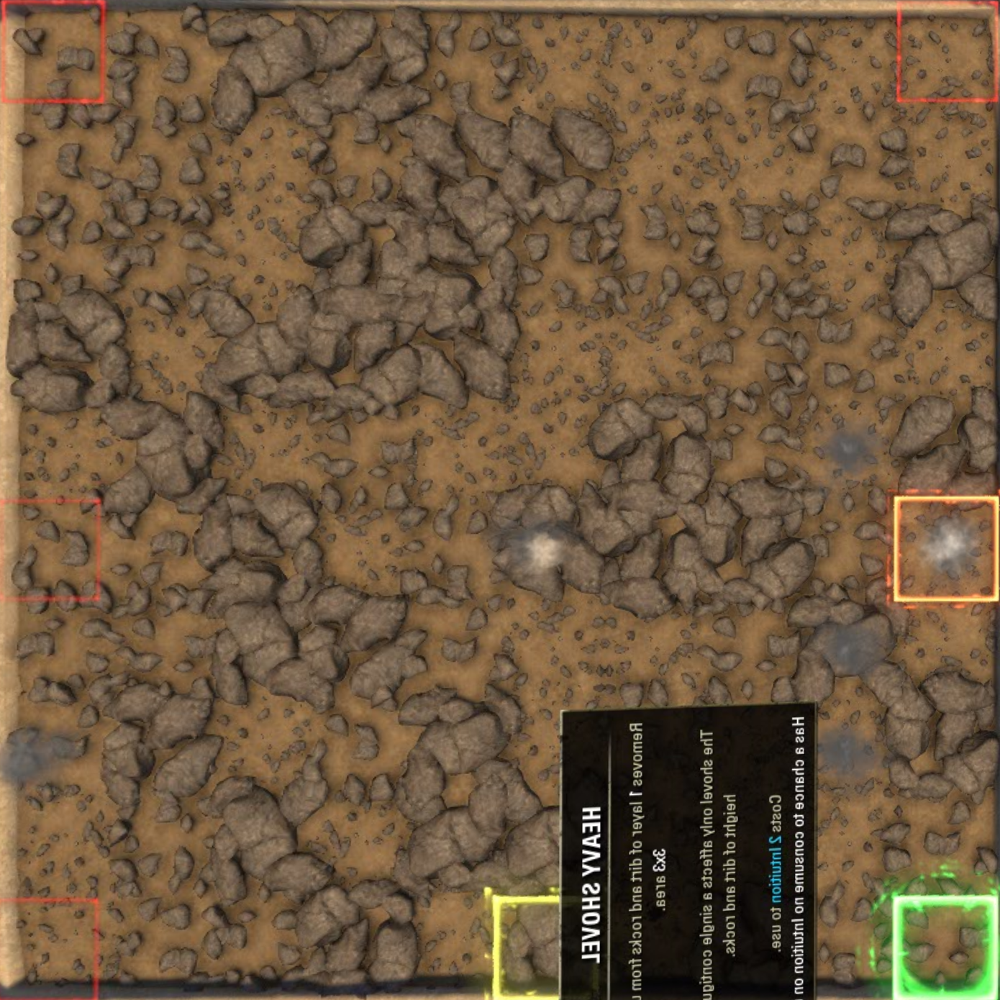

# Automating ESO Online's Dig

This section is dedicated to automating the ESO dig minigame and is deceptively complex.

## Accounting for Perspective

[Applying sample code from OpenCV](https://docs.opencv.org/4.x/da/d6e/tutorial_py_geometric_transformations.html)

Because the minigame takes place with an angled perspective, computer vision needs to be adjusted to account for this.

